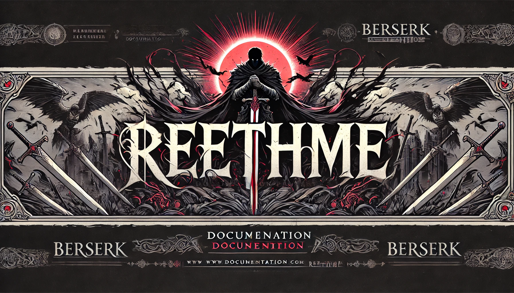

<!-- <div align="center"></div> -->
<h1 align="center">ReethMe - ドキュメント</h1>


<!-- Badges section -->
<div align="center">

 
[](https://opensource.org/licenses/MIT)

</div>
<!-- Badges section end -->


## Table of Contents
- [About](#-about)
- [Installation](#-installation)


## 📖 About
> [!NOTE]  
>  While the templates include a default setup for general projects, they can be customized to fit different visual styles and layouts based on your preferences.

This program uses Rust’s efficient concurrency model and powerful text templating capabilities to auto-generate personalized README files with rich formatting. It includes:

- **serde**: for serializing and deserializing JSON configurations for customizing README content.
- **tera**: a flexible templating engine for defining the README structure with user-specific variables.
- **tokio**: an asynchronous runtime to efficiently handle multiple I/O tasks, enabling quick processing for larger projects with multiple README files.

With this setup, the program allows you to produce highly customized and visually engaging README files that can incorporate the latest updates and templates effortlessly. 🚨 However, be aware that this advanced templating setup may require careful handling of configuration files to avoid potential mismatches.

## 🛠️ Installation

This repository depends purely on Rust, so you must have the [Rust](https://www.rust-lang.org/tools/install) enviroment installed.

### Windows Installation
If you use Windows as your OS, simply access the link of the oficial page and choose your installation methods.

### Linux Installation
First of all, you will need a C compiler for executing Rust programs. 
vLinux users should generally install GCC or Clang, according to their distribution’s documentation. For example, if you use Ubuntu, you can install the `build-essential` package by simply running.
```bash
sudo apt update
sudo apt install build-essential
```

Then you can execute the follwing command:

```bash
$ curl --proto '=https' --tlsv1.2 https://sh.rustup.rs -sSf | sh
```

The command downloads a script and starts the installation of the rustup tool, which installs the latest stable version of Rust. You might be prompted for your password. If the install is successful, the following line will appear:

```bash
Rust is installed now. Great!
```

### MacOS installation

For Mac users, it's pretty similar to Linux, just run the script installation:
```bash
$ curl --proto '=https' --tlsv1.2 https://sh.rustup.rs -sSf | sh
```

Then install the compiler with the following command:

```bash
xcode-select --install
```
<br>

<!-- <div align="center">
      
      <a href="https://www.linkedin.com/in/h%C3%A9ctor-blanco-garc%C3%ADa-42a749276/">
          <svg width="3%" viewBox="0 0 24 24" fill="none" xmlns="http://www.w3.org/2000/svg"><g id="SVGRepo_bgCarrier" stroke-width="0"></g><g id="SVGRepo_tracerCarrier" stroke-linecap="round" stroke-linejoin="round"></g><g id="SVGRepo_iconCarrier"> <path d="M6.5 8C7.32843 8 8 7.32843 8 6.5C8 5.67157 7.32843 5 6.5 5C5.67157 5 5 5.67157 5 6.5C5 7.32843 5.67157 8 6.5 8Z" fill="#e01212"></path> <path d="M5 10C5 9.44772 5.44772 9 6 9H7C7.55228 9 8 9.44771 8 10V18C8 18.5523 7.55228 19 7 19H6C5.44772 19 5 18.5523 5 18V10Z" fill="#e01212"></path> <path d="M11 19H12C12.5523 19 13 18.5523 13 18V13.5C13 12 16 11 16 13V18.0004C16 18.5527 16.4477 19 17 19H18C18.5523 19 19 18.5523 19 18V12C19 10 17.5 9 15.5 9C13.5 9 13 10.5 13 10.5V10C13 9.44771 12.5523 9 12 9H11C10.4477 9 10 9.44772 10 10V18C10 18.5523 10.4477 19 11 19Z" fill="#e01212"></path> <path fill-rule="evenodd" clip-rule="evenodd" d="M20 1C21.6569 1 23 2.34315 23 4V20C23 21.6569 21.6569 23 20 23H4C2.34315 23 1 21.6569 1 20V4C1 2.34315 2.34315 1 4 1H20ZM20 3C20.5523 3 21 3.44772 21 4V20C21 20.5523 20.5523 21 20 21H4C3.44772 21 3 20.5523 3 20V4C3 3.44772 3.44772 3 4 3H20Z" fill="#e01212"></path> </g></svg>
      </a>
      
      <a href="https://app.hackthebox.com/users/1546894">
        <svg width="3%" fill="#e01212" viewBox="0 0 24 24" role="img" xmlns="http://www.w3.org/2000/svg" stroke="#e01212"><g id="SVGRepo_bgCarrier" stroke-width="0"></g><g id="SVGRepo_tracerCarrier" stroke-linecap="round" stroke-linejoin="round"></g><g id="SVGRepo_iconCarrier"><path d="M11.996 0a1.119 1.119 0 0 0-.057.003.9.9 0 0 0-.236.05.907.907 0 0 0-.165.079L1.936 5.675a.889.889 0 0 0-.445.77v11.111a.889.889 0 0 0 .47.784l9.598 5.541.054.029v.002a.857.857 0 0 0 .083.035l.012.004c.028.01.056.018.085.024.01.001.011.003.016.004a.93.93 0 0 0 .296.015.683.683 0 0 0 .086-.015c.01 0 .011-.002.016-.004a.94.94 0 0 0 .085-.024l.012-.004a.882.882 0 0 0 .083-.035v-.002a1.086 1.086 0 0 0 .054-.029l9.599-5.541a.889.889 0 0 0 .469-.784V6.48l-.001-.026v-.008a.889.889 0 0 0-.312-.676l-.029-.024c0-.002-.01-.005-.01-.007a.899.899 0 0 0-.107-.07L12.453.127A.887.887 0 0 0 11.99 0zm.01 2.253c.072 0 .144.019.209.056l6.537 3.774a.418.418 0 0 1 0 .724l-6.537 3.774a.418.418 0 0 1-.418 0L5.26 6.807a.418.418 0 0 1 0-.724l6.537-3.774a.42.42 0 0 1 .209-.056zm-8.08 6.458a.414.414 0 0 1 .215.057l6.524 3.766a.417.417 0 0 1 .208.361v7.533a.417.417 0 0 1-.626.361l-6.523-3.766a.417.417 0 0 1-.209-.362V9.13c0-.241.196-.414.41-.418zm16.16 0c.215.004.41.177.41.418v7.532a.42.42 0 0 1-.208.362l-6.524 3.766a.417.417 0 0 1-.626-.361v-7.533c0-.149.08-.286.209-.36l6.523-3.767a.415.415 0 0 1 .216-.057z"></path></g></svg>
      </a>
      
      <a href="https://app.hackthebox.com/users/1546894">
       <svg width="3%" padding="3%" viewBox="0 0 20 20" version="1.1" xmlns="http://www.w3.org/2000/svg" xmlns:xlink="http://www.w3.org/1999/xlink" fill="#000000"><g id="SVGRepo_bgCarrier" stroke-width="0"></g><g id="SVGRepo_tracerCarrier" stroke-linecap="round" stroke-linejoin="round"></g><g id="SVGRepo_iconCarrier"> <title>github [e01212]</title> <desc>Created with Sketch.</desc> <defs> </defs> <g id="Page-1" stroke="none" stroke-width="1" fill="none" fill-rule="evenodd"> <g id="Dribbble-Light-Preview" transform="translate(-140.000000, -7559.000000)" fill="#e01212"> <g id="icons" transform="translate(56.000000, 160.000000)"> <path d="M94,7399 C99.523,7399 104,7403.59 104,7409.253 C104,7413.782 101.138,7417.624 97.167,7418.981 C96.66,7419.082 96.48,7418.762 96.48,7418.489 C96.48,7418.151 96.492,7417.047 96.492,7415.675 C96.492,7414.719 96.172,7414.095 95.813,7413.777 C98.04,7413.523 100.38,7412.656 100.38,7408.718 C100.38,7407.598 99.992,7406.684 99.35,7405.966 C99.454,7405.707 99.797,7404.664 99.252,7403.252 C99.252,7403.252 98.414,7402.977 96.505,7404.303 C95.706,7404.076 94.85,7403.962 94,7403.958 C93.15,7403.962 92.295,7404.076 91.497,7404.303 C89.586,7402.977 88.746,7403.252 88.746,7403.252 C88.203,7404.664 88.546,7405.707 88.649,7405.966 C88.01,7406.684 87.619,7407.598 87.619,7408.718 C87.619,7412.646 89.954,7413.526 92.175,7413.785 C91.889,7414.041 91.63,7414.493 91.54,7415.156 C90.97,7415.418 89.522,7415.871 88.63,7414.304 C88.63,7414.304 88.101,7413.319 87.097,7413.247 C87.097,7413.247 86.122,7413.234 87.029,7413.87 C87.029,7413.87 87.684,7414.185 88.139,7415.37 C88.139,7415.37 88.726,7417.2 91.508,7416.58 C91.513,7417.437 91.522,7418.245 91.522,7418.489 C91.522,7418.76 91.338,7419.077 90.839,7418.982 C86.865,7417.627 84,7413.783 84,7409.253 C84,7403.59 88.478,7399 94,7399" id="github-[e01212]"> </path> </g> </g> </g> </g></svg>
      </a>
</div>
</div> -->